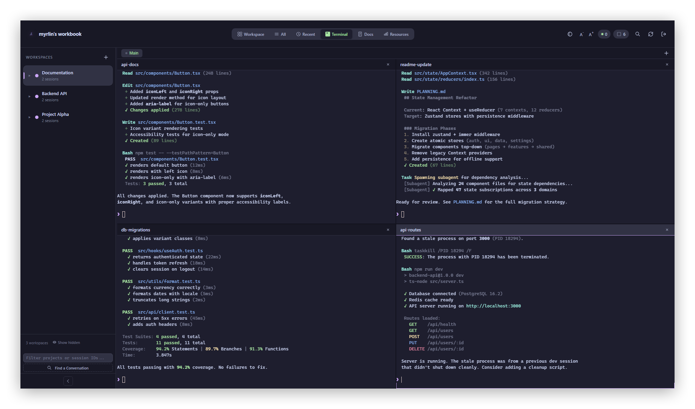
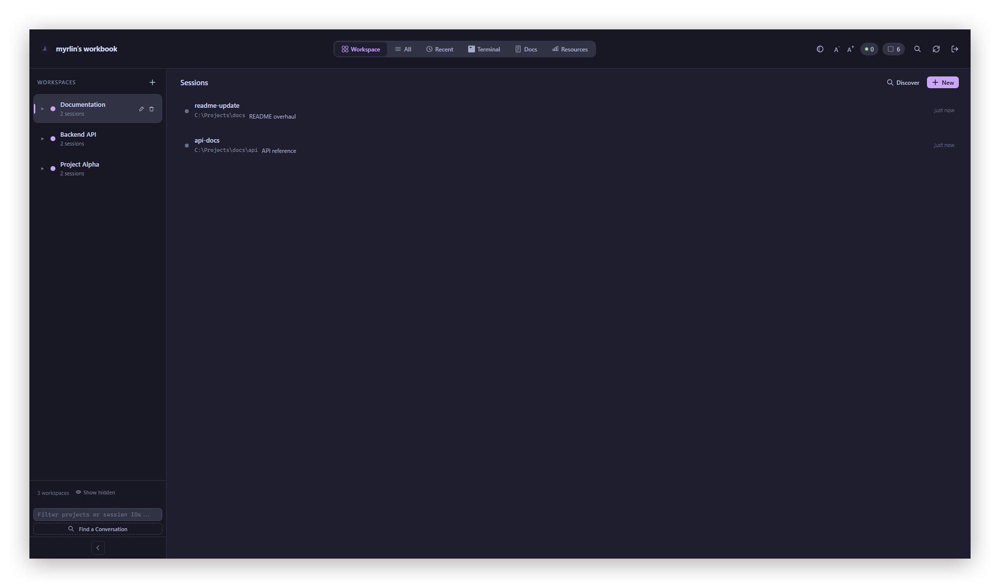
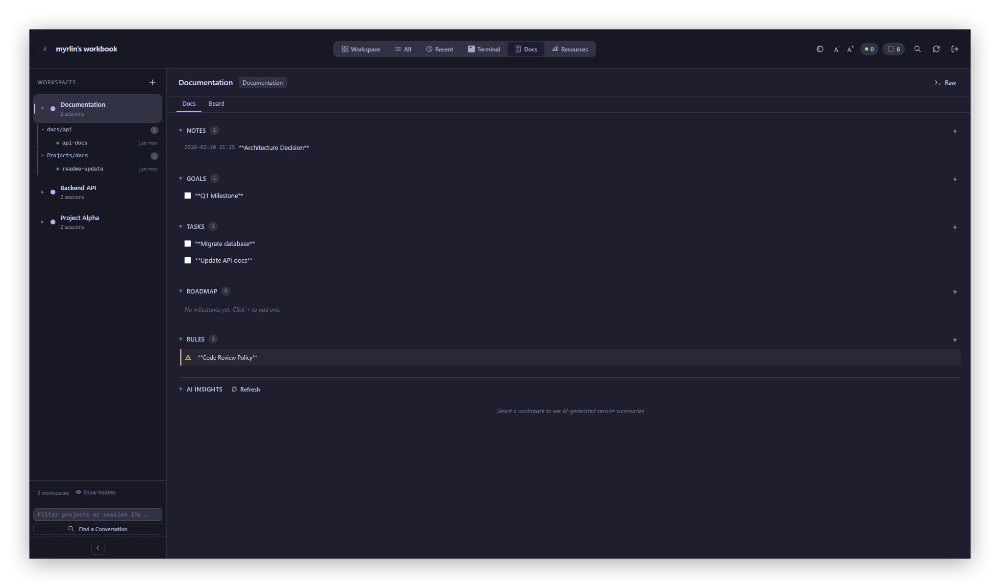
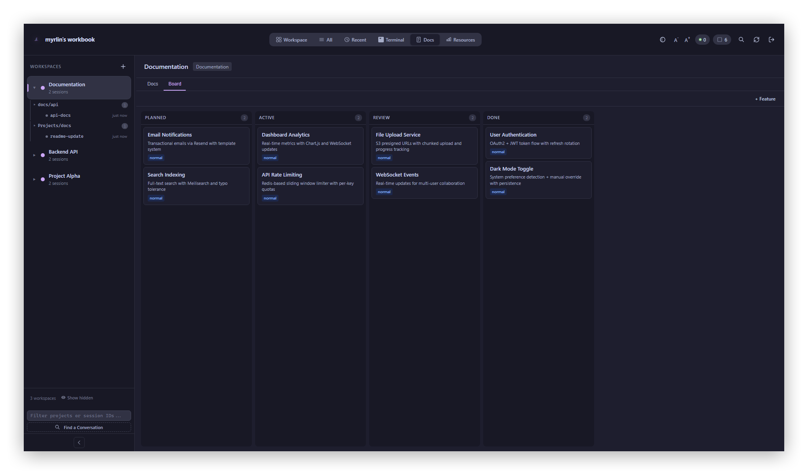
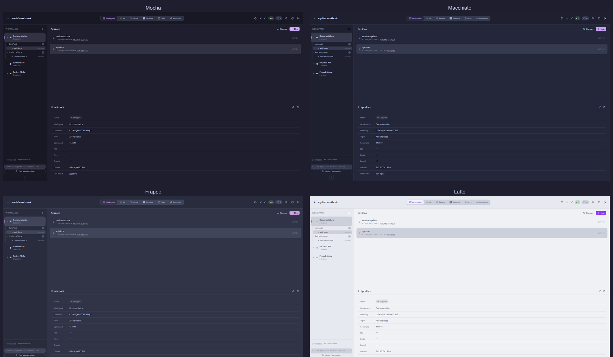

# Myrlin Workbook

Manage multiple Claude Code sessions from one browser tab. Workspaces, embedded terminals, session discovery, notes — all local.

> Currently supports Claude Code. Other AI coding tools on the [roadmap](#roadmap).



## Quick Start

```bash
git clone https://github.com/therealarthur/myrlin-workbook.git
cd myrlin-workbook
npm install
npm run gui
```

On first launch, a random password is generated and printed to the console. It's saved to `state/config.json` for next time.

**Custom password:**
```bash
CWM_PASSWORD=your-password npm run gui
```

### Run Modes

| Command | Description |
|---------|-------------|
| `npm run gui` | Web UI (opens browser at localhost:3456) |
| `npm run gui:demo` | Web UI with sample data |
| `npm start` | TUI mode (terminal-only, blessed) |
| `npm run demo` | TUI with sample data |
| `npm test` | Run tests (26 tests) |

### Requirements

- **Node.js 18+** (tested on 22.x)
- **Windows** — uses ConPTY via node-pty. Linux/macOS untested but should work.
- C++ build toolchain for node-pty (Visual Studio Build Tools on Windows, `build-essential` on Linux)

---

## Why

If you run more than a couple Claude Code sessions, you know the pain:
- Terminal tabs pile up with no way to tell them apart
- Sessions scattered across projects, no grouping
- No idea what's still running or what it was doing
- Crash = start over

This gives you a single dashboard to organize and run all of it.

### Why not the existing tools?

There are good tools out there — [Opcode](https://github.com/winfunc/opcode), [Claude Squad](https://github.com/smtg-ai/claude-squad), [CloudCLI](https://github.com/siteboon/claudecodeui), [Crystal](https://github.com/stravu/crystal), the official Claude Code desktop app. I tried them. Here's what pushed me to build this:

- **Most require tmux** — Claude Squad, Agent Deck, ccswitch, Agent of Empires are all tmux-based. I'm on Windows. Not an option without WSL.
- **Desktop apps aren't accessible remotely** — Opcode and Crystal are desktop-only. I wanted to check on sessions from my phone or another machine. This runs in a browser with optional Cloudflare tunnel access.
- **Git worktrees aren't how I think** — Almost every competitor organizes around git worktrees. I organize around *projects* with multiple sessions, each with their own notes, goals, and context. Workspaces with attached docs is the mental model I wanted.
- **No session discovery** — Most tools only manage sessions you create through them. This scans `~/.claude/projects/` and finds every session you've ever run, auto-titles them from the conversation content, and lets you import them.
- **CloudCLI is closest** but it's more of a remote IDE (file explorer, code editor). I wanted a session *command center* — terminals, workspace docs, resource monitoring, not another editor.

What those tools do better than this: Opcode has 20k stars and cost tracking. Claude Squad supports 5+ AI tools. Agent Deck has MCP socket pooling. Crystal has great git integration. This is alpha and Claude-only (for now). Just being honest.

---

## Features

### Workspaces & Sessions



- Named workspaces with color coding
- Group workspaces under umbrella folders
- Drag-and-drop sessions into terminal panes
- Session state tracking (running / stopped / error) with PID monitoring
- State persists to disk — survives crashes and restarts
- Auto-recovery on startup (detects orphaned sessions, restores state)

### Embedded Terminals

- 4-pane terminal grid (xterm.js + node-pty + WebSocket)
- Tab groups — named sets of terminal panes ("Research", "Debug"), switchable and persistent
- PTY sessions survive page refresh
- Scrollback replay on reconnect
- Model selection (Opus, Sonnet, Haiku) and session resume (`--resume`)
- Right-click context menu with Copy, Stop, Restart, Model selection

### Per-Workspace Docs & Feature Board



- Notes, Goals, Tasks, Rules, and Roadmap sections per workspace
- Kanban-style feature board (Planned → Active → Review → Done)
- Markdown editor with formatting toolbar
- AI Insights tab — auto-generated summaries of workspace sessions



### Project Discovery
- Scans `~/.claude/projects/` and finds all your existing Claude sessions
- Shows project directory, session count, size, last active
- Session summaries (parses JSONL to extract what each session was working on)
- Import sessions into workspaces with one click

### Resource Monitoring
- System overview (CPU, RAM, uptime)
- Per-session CPU and memory tracking with process control
- Stop, restart, or kill sessions directly from the Resources tab

### Themes



4 Catppuccin themes: Mocha (dark), Macchiato, Frappe, and Latte (light). Toggle from the header.

### Mobile
- Responsive layout with bottom tab bar
- Touch gestures (long-press for context menus, edge swipe for sidebar)

---

## Remote Access

You can expose your local instance with a Cloudflare tunnel:

```bash
# Start the server
npm run gui

# In another terminal
cloudflared tunnel --url http://localhost:3456
```

Cloudflared gives you a public URL. Open it from any device, log in with your password.

For a stable URL, see the [Cloudflare tunnel docs](https://developers.cloudflare.com/cloudflare-one/connections/connect-networks/) on named tunnels.

---

## Architecture

```
Browser (vanilla JS SPA)
  │
  ├── REST API ──────── Express server
  │                       ├── State store (JSON + EventEmitter)
  │                       ├── Session manager (launch/stop/restart)
  │                       ├── Resource monitoring (CPU, RAM, per-PID)
  │                       └── Workspace groups, discovery, docs
  │
  ├── SSE ───────────── Real-time updates (store events → clients)
  │
  └── WebSocket ─────── Terminal I/O (binary frames)
                           └── node-pty → ConPTY / PTY
```

No React, no build step. Vanilla JS SPA, Express backend.

### Project Structure

```
src/
├── state/
│   ├── store.js              # Core state (JSON persistence + EventEmitter)
│   └── docs-manager.js       # Per-workspace markdown docs
├── core/
│   ├── session-manager.js    # Launch/stop/restart processes
│   ├── workspace-manager.js  # Workspace CRUD
│   ├── process-tracker.js    # PID monitoring
│   ├── recovery.js           # Auto-recovery on startup
│   └── notifications.js      # Event-based notifications
├── web/
│   ├── server.js             # Express API + SSE + resources
│   ├── auth.js               # Token auth + rate limiting
│   ├── backup.js             # Frontend backup/restore
│   ├── pty-manager.js        # PTY session lifecycle
│   ├── pty-server.js         # WebSocket server for terminal I/O
│   └── public/
│       ├── index.html        # SPA shell
│       ├── app.js            # Frontend application
│       ├── styles.css        # Catppuccin Mocha theme
│       └── terminal.js       # TerminalPane (xterm.js + WebSocket)
├── ui/                       # TUI mode (blessed)
├── index.js                  # TUI entry point
├── demo.js                   # TUI demo
└── gui.js                    # GUI entry point
```

---

## Configuration

### Password

Loaded in order:
1. `CWM_PASSWORD` environment variable
2. `state/config.json` → `{ "password": "..." }`
3. Auto-generated (printed to console, saved to config)

### Port

Default `3456`. Override with `PORT`:
```bash
PORT=8080 npm run gui
```

### Theme

[Catppuccin Mocha](https://github.com/catppuccin/catppuccin) (dark) and Latte (light). Toggle with the moon/sun button in the top-right header. Choice persists in localStorage.

---

## Keyboard Shortcuts

| Key | Action |
|-----|--------|
| `Ctrl+K` / `Cmd+K` | Quick switcher |
| `Escape` | Close modals / menus |
| `Ctrl+Enter` | Save in notes editor |
| Double-click session | Inline rename |
| Right-click session | Context menu (launch, model, rename, hide) |
| Right-click workspace | Context menu (docs, add session, edit, delete) |

---

## Roadmap

- Multi-provider support (Codex, Cursor, Aider)
- ~~Session templates~~ shipped
- ~~Session search~~ shipped
- ~~Light theme~~ shipped (4 Catppuccin themes)
- ~~Cost tracking~~ shipped (per-session token + cost breakdown)
- ~~Feature board~~ shipped (Kanban per workspace)
- Export/import workspaces
- Pinned sessions
- Push notifications for session events

---

## License

**AGPL-3.0** — Use, modify, self-host freely. If you run a modified version as a public service, you must publish source. See [LICENSE](LICENSE).

---

## Contributing

Issues and PRs welcome. No build step — clone, `npm install`, hack.

```bash
npm test        # 26 tests
npm run gui     # Start dev server
```

---

Built by [Arthur](https://github.com/therealarthur).
