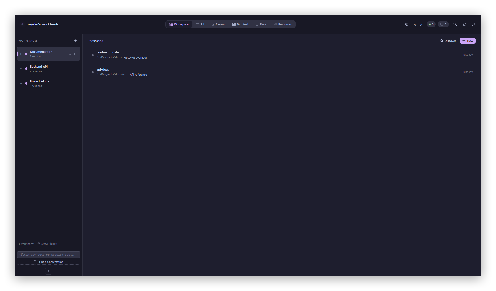
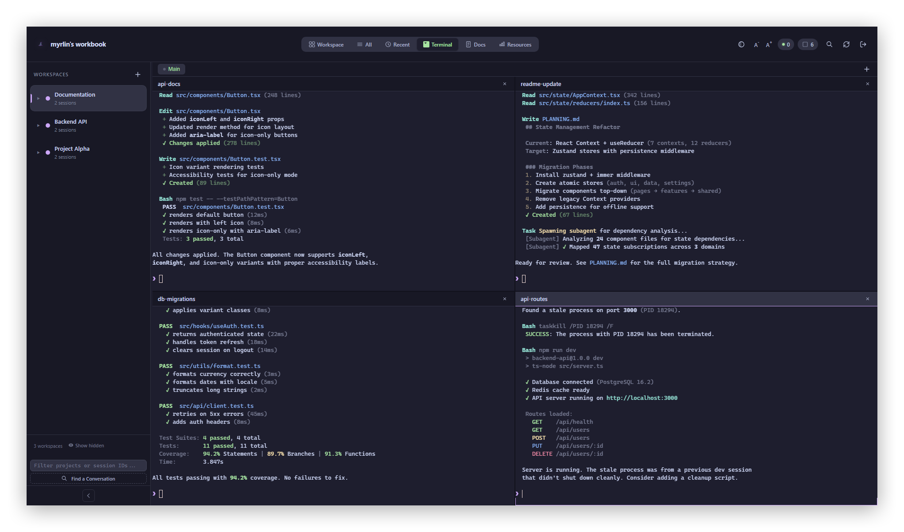
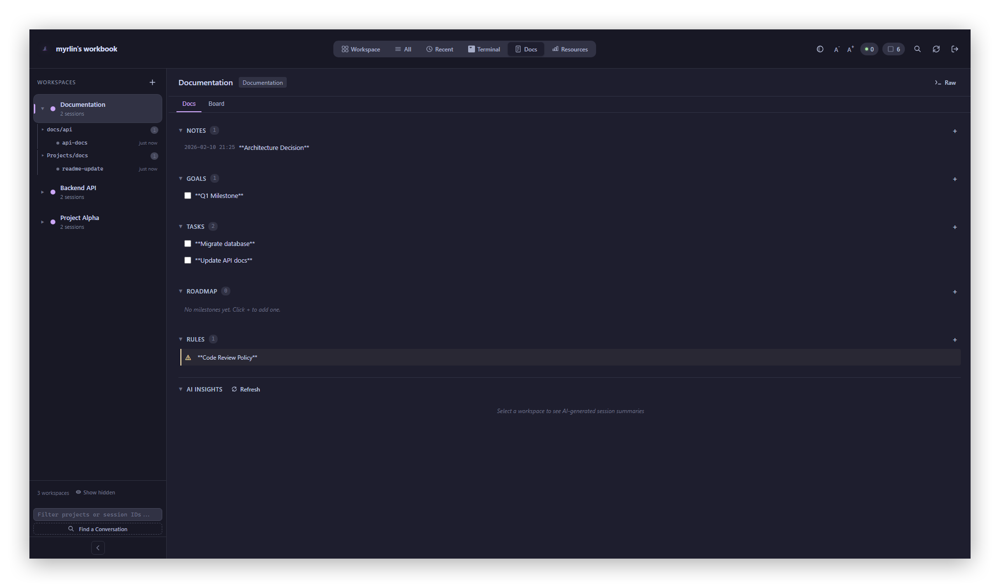
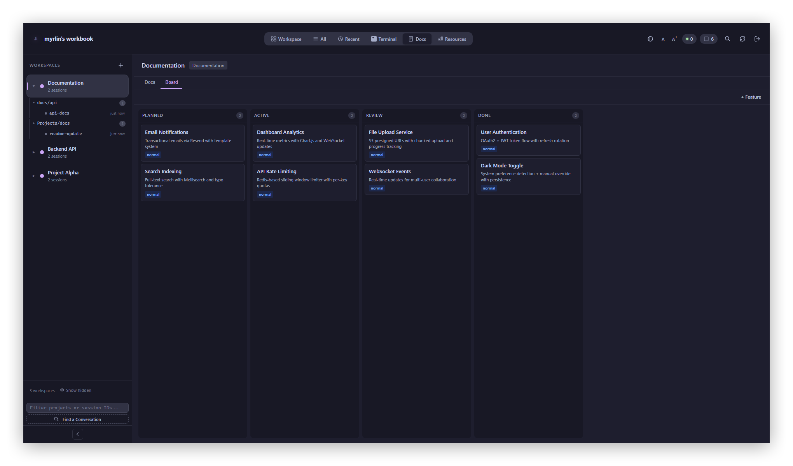
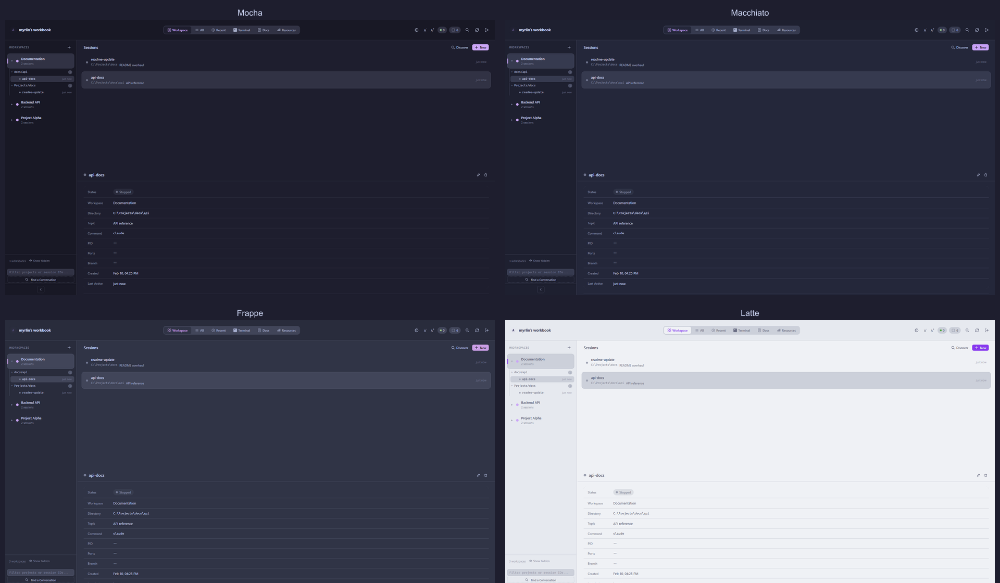

<p align="center">
  
</p>
<h1 align="center">Myrlin's Workbook</h1>
<p align="center">
  <a href="https://www.npmjs.com/package/myrlin-workbook"></a>
  <a href="https://www.npmjs.com/package/myrlin-workbook"></a>
  <a href="LICENSE"></a>
  <a href="https://nodejs.org"></a>
</p>

<p align="center">
Open-source workspace manager for AI coding CLIs. <b>Now multi-provider</b> (v1.2 alpha): Claude Code <i>and</i> ChatGPT Codex through one unified interface, with Gemini next. Multi-pane embedded terminals, cross-provider search, kanban with PR automation, cost tracking, conflict detection, per-project docs, session templates, 13 themes, <a href="#full-feature-list">and more</a>. Discovers every session across every provider, organizes them into projects. Runs in your browser, everything stays local.
</p>

<p align="center">
  <b>v1.2 alpha:</b> <code>npm i myrlin-workbook@alpha</code> — multi-provider, off by default for existing Claude users.<br>
  <b>v0.9 stable:</b> <code>npm i myrlin-workbook</code> — Claude-only, unchanged.
</p>

<p align="center">
  
</p>

---

## Quick Start

### Try it now

```bash
npx myrlin-workbook          # Stable (Claude only). Add @alpha for v1.2 multi-provider.
npx myrlin-workbook@alpha    # v1.2 alpha: Claude + ChatGPT Codex (off by default)
npx myrlin-workbook --demo   # Opens browser with sample data (no real sessions needed)
```

> **On the old version?** `npx myrlin-workbook` (and `@latest`) installs the stable line. All v1.2 multi-provider work ships under the `@alpha` tag until 1.2 goes stable. Use `npx myrlin-workbook@alpha` for the latest features.

### Install from source

```bash
git clone https://github.com/therealarthur/myrlin-workbook.git
cd myrlin-workbook
npm install
npm run gui                   # Real sessions
npm run gui:demo              # Sample data
```

### Password

On first launch, a random password is generated and saved to `~/.myrlin/config.json`. This password **persists across updates, reinstalls, and npx cache clears** — you'll always use the same password.

To set your own:

```bash
# Option 1: Edit the config file (recommended — persists forever)
# ~/.myrlin/config.json → { "password": "your-password-here" }

# Option 2: Environment variable (overrides config, per-session)
CWM_PASSWORD=mypassword npx myrlin-workbook
```

Password lookup order: `CWM_PASSWORD` env var > `~/.myrlin/config.json` > `./state/config.json` > auto-generate.

On startup, the console prints a clickable URL with a one-time token (e.g., `http://127.0.0.1:3456?token=<random>`). Click it to auto-login — the token is single-use and expires after 60 seconds, so it's safe even if it appears in terminal logs. The token is stripped from the URL bar immediately after login.

### Access from other devices on your LAN

By default the GUI binds to `127.0.0.1` (localhost only). To reach it from your phone, tablet, or another computer on the same network, bind to your machine's LAN IP with `CWM_HOST`:

```bash
# Find your LAN IP first (ipconfig on Windows, ifconfig/ip addr on macOS/Linux),
# then bind to it:
CWM_HOST=192.168.1.121 npx myrlin-workbook@alpha    # then open http://192.168.1.121:3456 from any LAN device
```

Override the port with `PORT` if 3456 is taken (e.g. `PORT=3457 CWM_HOST=192.168.1.121 npx myrlin-workbook@alpha`).

To avoid retyping the env var every launch, either export it in your shell profile (`export CWM_HOST=192.168.1.121`) or do a global install (`npm install -g myrlin-workbook@alpha`) and run the `myrlin` command.

> **Security:** binding to a LAN IP exposes the login page to everyone on that network. The password/token auth above is the only gate, so set a strong password before doing this.

### Prerequisites

- **Node.js 18+** ([download](https://nodejs.org))
- **C++ Build Tools** (required by `node-pty` for real terminal emulation):
  - **Windows**: [Visual Studio Build Tools](https://visualstudio.microsoft.com/visual-cpp-build-tools/) with "Desktop development with C++" workload
  - **macOS**: `xcode-select --install`
  - **Linux**: `sudo apt install build-essential python3`

> **`npm install` fails?** You're missing the C++ build tools above. See [Troubleshooting](#troubleshooting).

### Run Modes

| Command | Description |
|---------|-------------|
| `npx myrlin-workbook` | Web GUI via npx |
| `npm run gui` | Web GUI (localhost:3456) |
| `npm run gui:demo` | Web GUI with sample data |
| `npm start` | TUI mode (terminal-only, blessed) |
| `npm run demo` | TUI with sample data |

---

## Why

I use Claude Code daily and had a growing list of pet peeves. Can't name sessions, so `/resume` is just picking from a list of IDs. No shift+enter for multiline. If you have a few sessions going at once, the terminal window juggling gets old fast. PC restarts and you have to reopen everything from scratch. No idea what you're spending.

Got fed up and built something for it. Myrlin scans `~/.claude/projects/`, finds every session you've ever run, and you organize them into projects with embedded terminals, docs, and cost tracking. Everything runs locally, no cloud, no telemetry.

### Compared to other tools

There are good tools in this space. I tried them. Here's where Myrlin fits:

| Feature | Myrlin | [ClaudeCodeUI](https://github.com/siteboon/claudecodeui) | [Opcode](https://github.com/winfunc/opcode) | [Claude Squad](https://github.com/smtg-ai/claude-squad) |
|---------|--------|-------------|--------|-------------|
| Cost tracking | Yes | No | Yes | No |
| Costs dashboard | Yes | No | Yes | No |
| Session discovery | Yes | Yes | No | No |
| Session manager overlay | Yes | No | No | No |
| Project docs/kanban | Yes | No | No | No |
| Themes | 13 (Catppuccin, Nord, Dracula, etc.) | No | No | No |
| Session templates | Yes | No | No | No |
| Conflict detection | Yes | No | No | No |
| Kanban task board | Yes (5 columns + DnD) | No | No | Yes (basic) |
| PR automation | Yes (AI descriptions + gh) | No | No | No |
| Model orchestration | Yes (per stage) | No | No | No |
| Embedded terminals | 4-pane grid | Single | No | No |
| Tab grouping | Yes | No | No | No |
| Windows native | Yes | Buggy | Yes (desktop) | No (tmux) |
| TUI mode | Yes | No | No | No |
| Multi-agent | Claude only | Claude+Cursor+Codex | Claude only | 5+ tools |
| File explorer | No | Yes | No | No |
| npx install | Yes | Yes | No | No |
| Build step required | None | Vite | Tauri | None |

**What those tools do better:** ClaudeCodeUI has a file explorer and multi-agent support. Opcode is a polished desktop app with 20k stars. Claude Squad supports 5+ AI tools. Myrlin is project-first with cost tracking and per-project docs. Different approach to the same problem.

---

## Features

### Cost Tracking

Per-session and per-workspace cost breakdown. Parses Claude's JSONL usage data, applies model-aware pricing (Opus, Sonnet, Haiku), shows input/output/cache tokens. Know exactly what you're spending.

### Session Discovery

- Scans `~/.claude/projects/` and finds all existing Claude sessions
- Shows project directory, session count, size, last active
- Auto-titles sessions from conversation content
- Import sessions into workspaces with one click

### Projects, Focuses & Sessions



Myrlin uses a 3-level organizational hierarchy:

```
Category ("Side Projects", "Work")     -- optional top-level grouping
  Project ("Myrlin Workbook")          -- the codebase / main container
    Focus ("UI Polish", "Backend")     -- sub-groups within a project
      Sessions                         -- Claude Code conversations
```

- **Categories** group related projects (e.g., "Work" vs "Side Projects")
- **Projects** are the main containers -- one per codebase, with color coding and docs
- **Focuses** are sub-groups within a project for different areas of work
- Drag-and-drop sessions between projects and into terminal panes
- Tab groups are free-form -- mix sessions from any project in any tab
- State persists to disk. Survives crashes and restarts
- Auto-recovery on startup (detects orphaned sessions, restores state)

### Embedded Terminals



- 4-pane terminal grid (xterm.js + node-pty + WebSocket). Real PTY, not fake.
- Tab groups: named sets of terminal panes ("Research", "Debug"), switchable and persistent
- PTY sessions survive page refresh with scrollback replay on reconnect
- Model selection (Opus, Sonnet, Haiku) and session resume
- Right-click context menu with Copy, Stop, Restart, Model picker

### Per-Project Docs & Feature Board




- Notes, Goals, Tasks, Rules, and Roadmap sections per project
- Kanban-style feature board (Planned -> Active -> Review -> Done)
- Markdown editor with formatting toolbar
- AI Insights tab: auto-generated summaries of project sessions



### td Integration (Optional)

Myrlin optionally integrates with [td](https://github.com/marcus/td), a minimalist CLI task manager built for AI agent workflows. When `td` is installed and initialized in a repo, Myrlin surfaces its issues directly in the docs panel and sidebar — no context-switching to the terminal.

**Install td:**
```bash
go install github.com/marcus/td@latest
```

**Enable:** Settings → td Task Management → toggle on. Set the binary path if `td` isn't on your PATH (e.g. `~/.local/bin/td` or `~/go/bin/td`).

**Worktree promotion:** Click "→ Worktree" on any td issue to create a git worktree + Claude session in one click, with the issue description passed as the opening prompt to Claude.

See [Why td alongside the built-in kanban?](#td-vs-built-in-kanban) for when this makes sense.

### Session Templates

Save your common launch configurations. Pre-set working directory, model, flags, and spawn options. One click to launch a new session from a template.

### Conflict Detection

Real-time warnings when two or more running sessions are editing the same files. Runs `git status` across active sessions and cross-references modified files. Prevents you from stepping on your own work.

### Quick Switcher

`Ctrl+K` / `Cmd+K` opens a fuzzy search across all sessions and projects. Jump to anything instantly.

### Git & Worktree Management

- Full git status per project: current branch, dirty/clean, ahead/behind remote
- Branch listing and worktree CRUD
- **"New Feature Session"**: right-click a project -> creates a branch + worktree + Claude session in one click
- Branch badges on session rows

### Themes




13 themes organized into Dark and Light sections. 4 official [Catppuccin](https://github.com/catppuccin/catppuccin) (Mocha, Macchiato, Frappe, Latte), 3 community favorites (Nord, Dracula, Tokyo Night), 4 custom flavors (Cherry, Ocean, Amber, Mint), and 2 light alternatives (Rose Pine Dawn, Gruvbox Light). Toggle from the header dropdown. Choice persists in localStorage.

### Port Detection & Resource Monitoring

- Automatic port detection for running sessions (PowerShell on Windows, lsof on Unix)
- Per-session CPU and memory tracking
- System overview (CPU, RAM, uptime)
- Stop, restart, or kill sessions from the Resources tab

### Mobile

<p align="center">
  
  &nbsp;&nbsp;&nbsp;
  
</p>

- Responsive layout with bottom tab bar
- Touch gestures: swipe between terminal panes, edge swipe for sidebar, long-press for context menus
- Mobile terminal toolbar: keyboard toggle, Enter, Tab, Ctrl+C, Ctrl+D, Esc, arrows, Copy, Upload
- Keyboard-aware viewport resizing (terminal stays visible above soft keyboard)

---

## Full Feature List

A comprehensive list of everything Myrlin Workbook offers today.

### Core

- **Session discovery** - scans `~/.claude/projects/`, finds every session you've ever run
- **Project management** - 3-level hierarchy (Category > Project > Focus), color coding, drag-and-drop
- **Auto-recovery** - restores state after crash or restart, detects orphaned sessions
- **State persistence** - JSON on disk, survives everything

### Terminals

- **4-pane terminal grid** - xterm.js + node-pty + WebSocket, real PTY (not fake)
- **Tab groups** - named sets of panes ("Research", "Debug"), switchable and persistent
- **Tab close buttons** - with live session kill confirmation dialog
- **Drag-and-hold tab grouping** - hold 1.2s over another tab to create a folder
- **Cross-tab terminal pane dragging** - drag sessions between panes freely
- **PTY sessions survive page refresh** - scrollback replay on reconnect
- **Model selection** - Opus, Sonnet, Haiku per terminal
- **Right-click context menu** - Copy, Stop, Restart, Model picker
- **Bracketed paste mode** - proper paste handling in terminal sessions

### Cost Tracking

- **Per-session and per-project cost breakdown** - input/output/cache tokens
- **Costs dashboard tab** - period selector (Day / Week / Month / All)
- **SVG timeline chart** - visual spend over time, model breakdown
- **Sortable session table** - rank sessions by cost, tokens, or duration
- **Parses JSONL usage data** - model-aware pricing (Opus, Sonnet, Haiku)

### Session Management

- **Session manager overlay** - click header stats to open, full session control
- **Mass selection and batch stop** - select multiple sessions, stop them all at once
- **Filter** - All / Running / Stopped quick filters
- **One-click terminal open** - from session manager rows
- **Session templates** - save launch configs (directory, model, flags), one-click launch
- **Quick switcher** - `Ctrl+K` / `Cmd+K` fuzzy search across sessions and projects

### Docs & Planning

- **Per-project docs** - Notes, Goals, Tasks, Rules, Roadmap sections
- **Kanban-style feature board** - Planned, Active, Review, Done columns
- **Markdown editor** - with formatting toolbar
- **AI Insights tab** - auto-generated summaries of project sessions
- **td integration** (optional) - surface [td](https://github.com/marcus/td) issues in the docs panel and sidebar; promote any issue to a git worktree + Claude session in one click

### Conflict Detection

- **Real-time file conflict warnings** - detects when two+ sessions edit the same files
- **Conflict center UI** - per-file breakdown with session attribution
- **Click session chips** - jump directly to the terminal pane for that session

### Git, Worktree Tasks & PR Automation

- **Git status per project** - current branch, dirty/clean, ahead/behind remote
- **Branch listing and worktree CRUD** - create, switch, delete from the UI
- **"New Feature Session"** - creates branch + worktree + Claude session in one click
- **Kanban task board** - 5-column (Backlog, Planning, Running, Review, Done) drag-and-drop workflow
- **PR automation** - create GitHub PRs via `gh` CLI, AI-generated descriptions from diffs
- **PR state tracking** - badges on cards (open/draft/merged/closed), auto-advance on merge
- **Multi-model orchestration** - assign models per task, default model per workflow stage
- **Task dependencies** - blocking relationships with visual indicators on cards
- **Cross-cutting tags** - color-coded tag badges, searchable, editable via context menu
- **Concurrent task limits** - configurable max (1-8), enforced on create and column drag
- **Worktree init hooks** - auto-copy files and run scripts after worktree creation
- **Branch badges** - shown on session rows

### Themes

- **13 themes** - 4 Catppuccin (Mocha, Macchiato, Frappe, Latte) + Nord, Dracula, Tokyo Night + Cherry, Ocean, Amber, Mint + Rose Pine Dawn, Gruvbox Light
- **Header dropdown toggle** - choice persists in localStorage

### Resources & Monitoring

- **Port detection** - automatic discovery for running sessions (PowerShell on Windows, lsof on Unix)
- **Per-session CPU and memory** - live tracking
- **System overview** - CPU, RAM, uptime
- **Stop / restart / kill** - from the Resources tab

### Mobile

- **Responsive layout** - bottom tab bar on small screens
- **Touch gestures** - swipe between panes, edge swipe for sidebar, long-press for context menus
- **Mobile terminal toolbar** - keyboard toggle, Enter, Tab, Ctrl+C, Ctrl+D, Esc, arrows, Copy, Upload
- **Keyboard-aware viewport** - terminal stays visible above soft keyboard

... more to come.

---

## Remote Access

Expose your local instance with a Cloudflare tunnel:

```bash
npm run gui                                      # Start the server
cloudflared tunnel --url http://localhost:3456    # In another terminal
```

Open the URL from any device. All WebSocket terminal connections, SSE streams, and REST API calls route through the tunnel. For a stable URL, see [Cloudflare tunnel docs](https://developers.cloudflare.com/cloudflare-one/connections/connect-networks/).

---

## Architecture

```
Browser (vanilla JS SPA)
  |
  |-- REST API ---------- Express server
  |                         |-- State store (JSON + EventEmitter)
  |                         |-- Session manager (launch/stop/restart)
  |                         |-- Resource monitoring (CPU, RAM, per-PID)
  |                         +-- Project hierarchy, discovery, docs
  |
  |-- SSE --------------- Real-time updates (store events -> clients)
  |
  +-- WebSocket --------- Terminal I/O (binary frames)
                             +-- node-pty -> ConPTY / PTY
```

No React, no build step. Vanilla JS SPA, Express backend. ~24 source files, 42 tests.

### Project Structure

```
src/
|-- state/
|   |-- store.js              # Core state (JSON persistence + EventEmitter)
|   +-- docs-manager.js       # Per-project markdown docs
|-- core/
|   |-- session-manager.js    # Launch/stop/restart processes
|   |-- workspace-manager.js  # Project/Focus CRUD
|   |-- process-tracker.js    # PID monitoring
|   |-- recovery.js           # Auto-recovery on startup
|   +-- notifications.js      # Event-based notifications
|-- web/
|   |-- server.js             # Express API + SSE + resources
|   |-- auth.js               # Token auth + rate limiting
|   |-- pty-manager.js        # PTY session lifecycle
|   +-- public/
|       |-- index.html        # SPA shell
|       |-- app.js            # Frontend application
|       |-- styles.css        # Catppuccin themes
|       +-- terminal.js       # TerminalPane (xterm.js + WebSocket)
|-- ui/                       # TUI mode (blessed)
|-- index.js                  # TUI entry point
+-- gui.js                    # GUI entry point
```

---

## Configuration

### Password

Loaded in order:
1. `CWM_PASSWORD` environment variable
2. `state/config.json` -> `{ "password": "..." }`
3. Auto-generated (printed to console, saved to config)

### Port

Default `3456`. Override with `PORT`:

```bash
PORT=8080 npm run gui
```

---

## Keyboard Shortcuts

| Key | Action |
|-----|--------|
| `Ctrl+K` / `Cmd+K` | Quick switcher |
| `Escape` | Close modals / menus |
| `Ctrl+Enter` | Save in notes editor |
| Double-click session | Inline rename |
| Right-click session | Context menu (launch, model, rename, hide) |
| Right-click project | Context menu (docs, add session, edit, delete) |

---

## Troubleshooting

### `npm install` fails with node-gyp errors
`node-pty` needs C++ build tools to compile native bindings. Install the tools listed in [Prerequisites](#prerequisites).

**Windows quick fix:**
```powershell
npm install -g windows-build-tools
```

### `npx myrlin-workbook` hangs on install
Same issue. node-pty is compiling. If it fails, install the C++ build tools first, then try again.

### npm blocked the node-pty install script (terminals disabled)
Modern npm (11.16 and later; the default in npm 12) blocks dependency install
scripts until you approve them. When node-pty's build script is blocked, the
native terminal binary is never compiled, so the server boots in degraded mode
with the terminal panes disabled (everything else keeps working). Approve the
script and rebuild (approving alone does not rebuild an already-installed copy):

```bash
npm install-scripts approve node-pty
npm rebuild node-pty --foreground-scripts
```

Then restart the app.

### `npx` crash: `Cannot find module './prebuilds/linux-x64//pty.node'`
node-pty ships prebuilt binaries only for macOS and Windows; on Linux it must
compile during install. If the toolchain was missing or the install script was
blocked, an `npx` run can crash with an error like
`Cannot find module './prebuilds/linux-x64//pty.node'`.

As of the fix for [issue #68](https://github.com/therealarthur/myrlin-workbook/issues/68),
the app no longer crashes in this case: it boots without terminals and prints a
platform-specific remediation banner. To restore terminals on Linux:

1. Install the build toolchain (Debian / Ubuntu):
   ```bash
   sudo apt install build-essential python3
   ```
2. Clear the stale `npx` cache so it reinstalls fresh, then rerun:
   ```bash
   npx clear-npx-cache
   # or remove it manually: rm -rf ~/.npm/_npx
   ```
3. If npm blocked the install script, approve and rebuild as shown in the
   previous section.

**Still stuck?** Open an [issue](https://github.com/therealarthur/myrlin-workbook/issues) with your full error output and OS version.

---

## Roadmap

### Next Up: Task Spinoff from Sessions

**The killer feature.** Right-click any running Claude session, select "Spinoff Tasks..." and AI extracts actionable tasks from the conversation. Each task gets a pre-filled creation form with context, relevant files, and acceptance criteria. Confirm, and each task spins off to its own worktree branch with a structured context handoff document -- not a raw conversation dump, but a spec (current state, desired state, file inventory, constraints). Tasks appear on the kanban board, run in parallel on isolated branches, and report back with PRs when done.

No other tool extracts tasks from a running session's conversation. Cursor spawns agents from issues. Copilot Workspace goes issue-to-PR. Devin works sequentially. Myrlin is the first to let you take an in-progress conversation, break it into parallel autonomous tasks, and orchestrate them from a kanban board -- all with proper context engineering so each agent knows exactly what to build without the parent's full history polluting its context window.

### Coming Soon

- **Task spinoff from sessions** - right-click -> extract tasks -> parallel worktree agents with structured context handoff
- **Collapsible sidebar** - toggle for more terminal space
- **6-pane grid** - smart layouts for 1-6 panes with no dead space
- **Pane drag-and-drop** - reorder terminal panes by dragging headers
- **Saveable layouts** - named pane configurations you can switch between
- **Frosted glass permission prompts** - blur overlay with clickable buttons when Claude asks for input
- **Per-action cost breakdown** - token usage per tool call, not just session totals
- **Conflict detection v2** - file-level collision warnings across parallel agents
- **Multi-provider support** - Claude + Codex + Aider in the same workspace

### Recently Shipped (alpha.6 - alpha.12)

- **Kanban workflow board** - 5 columns (Backlog, Planning, Running, Review, Done) with drag-and-drop
- **PR automation** - AI-generated descriptions via `claude --print`, create/track PRs via `gh`, auto-advance on merge
- **Multi-model orchestration** - default model per stage, auto-assignment on column transitions
- **Cross-cutting tags** - color-coded tag badges on tasks and sessions, searchable
- **Agent teams UX** - workflow explanation, stage progress dots, model hints
- **Task dependencies** - blocking relationships with visual indicators
- **Concurrent task limits** - configurable max (1-8), enforced on create and drag
- **Task search** - filter kanban by branch, description, model, status, tags
- **Live terminal preview** - running task cards show last terminal line
- **Worktree init hooks** - copy files and run scripts after worktree creation

### Previously Shipped

- Project hierarchy (Category > Project > Focus > Sessions)
- 3-pane grid layout, worktree tasks, conflict center, session manager overlay
- Costs dashboard, tab grouping, session templates, session search
- 13 themes, cost tracking, feature board, git worktree management
- Port detection, mobile support, auto-trust dialogs

---

## td vs Built-in Kanban

Myrlin's kanban board and `td` solve different problems and work well together.

| | Myrlin Kanban | td |
|---|---|---|
| **Lives in** | Myrlin's state store | `.todos/` directory in the repo |
| **Follows git?** | No | Yes — committed alongside code |
| **AI agent access** | Via Myrlin GUI | Via `td` CLI in any terminal |
| **Session isolation** | No | Yes — implementer can't approve own work |
| **Handoff structured state** | No | Yes — `td handoff --done / --remaining / --decision` |
| **Worktree per task** | Yes (Myrlin creates it) | Via Myrlin's "→ Worktree" button |
| **PR tracking** | Yes (via gh) | No |
| **Cross-context memory** | No | Yes — designed for AI agent workflows |

**Use Myrlin's kanban** to orchestrate worktrees, track PR state, manage dependencies, and coordinate parallel agents at the project level.

**Use td** inside those worktrees to track granular sub-tasks, log decisions, and hand off structured context to the next agent session — especially useful when a task spans multiple context windows or requires a review step by a separate session.

---

## License

**AGPL-3.0.** Use, modify, self-host freely. If you run a modified version as a public service, you must publish source. See [LICENSE](LICENSE).

---

## Contributing

Issues and PRs welcome. No build step. Clone, `npm install`, hack.

```bash
npm test        # 42 tests
npm run gui     # Start dev server
```

---

Built by [Arthur](https://github.com/therealarthur).
